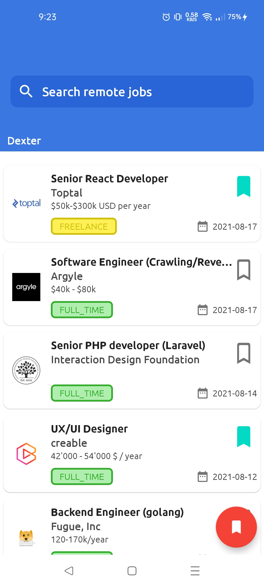
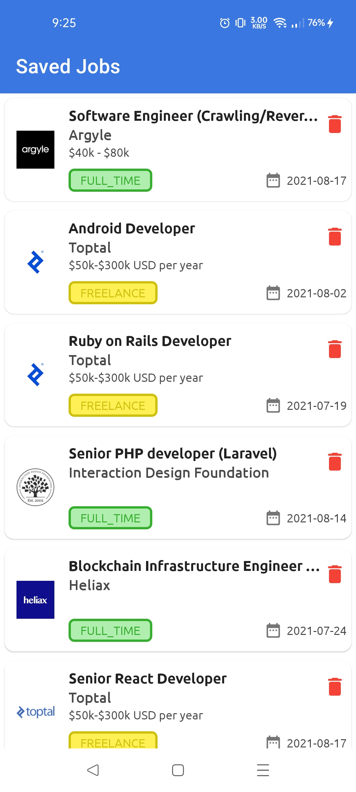

# Description 

- Application Name - **DEXTER**
- Architecture Used - MVVM
- Language Used - Kotlin (v1.4.32)
- IDE used - Android Studio (v4.1.2)  
- Database used - ROOM database

# About
 - Android Application for searching and applying for Remote Jobs
 - Save Jobs to apply later

# Topics

- ROOM database
- Kotlin Coroutines
- MVVM architecture
- Retrofit
- DiffUtil
- Material Design
- LiveData
- ViewModel

# Screenshots

 | Retrieve Remote Jobs | Save Remote Jobs | 
 --------------|------------|
 |  |   |

